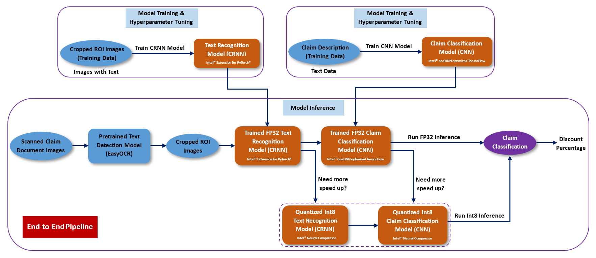

# Invoice-to-Cash Automation

## Introduction
This reference kit introduces an Artificial Intelligence (AI) solution geared towards automating the processing of user’s claim documents in Consumer Product companies. The proposed system follows a two-stage workflow that first extracts meaningful text from a given scanned claim document and then categorizes it in a specific promotion claim class. The extraction phase is conducted via Optical Character Recognition (OCR), whereas a Convolutional Neural Network (CNN) is used for text classification. The solution is refined by leveraging the optimization features provided by Intel® Extension for PyTorch\*, Intel® oneDNN optimized TensorFlow\* and Intel® Neural Compressor.

## Solution Technical Overview
Clients (i.e., retailers) may have hundreds of promotions that a Consumer Product company may offer for them to use. Clients need to properly follow the promotion for them to get the deduction (a.k.a. claims) applied after the Consumer Product company validates. Getting, sorting, and storing client’s claims is a significant time-consuming task that is part of the deduction validation process that the Accounts Receivable (AR) team of Consumer Product Company needs to conduct. After a client sends a payment and applies a deduction, to validate the claim the AR Analyst will need to get claim information from different sources such as client's website, client’s email, or client’s claims systems where clients documents their claims. The information will come in different formats which makes the documentation very challenging.

To fully automate this process, Consumer Product companies would need to be able to address all the below pain points:
- Support extraction of multiple format claim documents from different sources like scanned documents, emails, websites, images.
- Support claim content capture, reading and analysis of content.
- Support claim categorization, so claims can be stored and matched in a second stage.

For the context of this reference solution, we have limited the experiment only to scanned documents extraction and claim categorization. To be more precise, this reference kit presents an AI solution based on deep learning models to address the tasks of extracting text from a claim document (e.g., invoice) image and the classification of such text into a particular claim category, where this category represents some discount that the client will obtain.

The task of extracting text from scanned documents will be performed via an OCR system. In an OCR pipeline, an input document image flows into a text detection component and next, it is processed by a text recognition component. For the present use case, a Python\* library called EasyOCR is used for the detection phase of the OCR pipeline, whilst a Convolutional Recurrent Neural Network (CRNN) is used to carry out the text recognition step. Regarding the categorization of text contained in client’s claim documents, a Convolutional Neural Network (CNN) trained for text classification is implemented. 

Besides offering a two-stage pipeline to automate the extraction and categorization of text within claim documents, the proposed solution considers the scale demands for a production environment by incorporating the following Intel ® packages:

* ***Intel® Distribution for Python\****

  The [Intel® Distribution for Python\*](https://www.intel.com/content/www/us/en/developer/tools/oneapi/distribution-for-python.html) provides:

    * Scalable performance using all available CPU cores on laptops, desktops, and powerful servers
    * Support for the latest CPU instructions
    * Near-native performance through acceleration of core numerical and machine learning packages with libraries like the Intel® oneAPI Math Kernel Library (oneMKL) and Intel® oneAPI Data Analytics Library
    * Productivity tools for compiling Python\* code into optimized instructions
    * Essential Python\* bindings for easing integration of Intel® native tools with your Python\* project

* ***Intel® Extension for PyTorch\****

  With a few lines of code, you can use [Intel® Extension for PyTorch\*](https://www.intel.com/content/www/us/en/developer/tools/oneapi/optimization-for-pytorch.html#gs.5vjhbw) to:
    * Take advantage of the most up-to-date Intel software and hardware optimizations for PyTorch\*.
    * Automatically mix different precision data types to reduce the model size and computational workload for inference.
    * Add your own performance customizations using APIs.

* ***[Intel® Optimizations for TensorFlow\*](https://www.intel.com/content/www/us/en/developer/tools/oneapi/optimization-for-tensorflow.html#gs.174f5y)***

    * Accelerate AI performance with Intel® oneAPI Deep Neural Network Library (oneDNN) features such as graph optimizations and memory pool allocation.
    * Automatically use Intel® Deep Learning Boost instruction set features to parallelize and accelerate AI workloads.
    * Reduce inference latency for models deployed using TensorFlow Serving.
    * Starting with TensorFlow 2.9, take advantage of oneDNN optimizations automatically.
    * Enable optimizations by setting the environment variable TF_ENABLE_ONEDNN_OPTS=1 in TensorFlow\* 2.5 through 2.8.

* ***Intel® Neural Compressor***

  [Intel® Neural Compressor](https://www.intel.com/content/www/us/en/developer/tools/oneapi/neural-compressor.html#gs.5vjr1p) performs model compression to reduce the model size and increase the speed of deep learning inference for deployment on CPUs or GPUs. This open source Python\* library automates popular model compression technologies, such as quantization, pruning, and knowledge distillation across multiple deep learning frameworks.

In the [Solution Technical Details](#solution-technical-details) section, the interested reader can find a more comprehensive technical discussion about the text extraction and categorization components of the present solution, while the workflow of the system is described in the [How it Works Section](#how-it-works), along with an explanation on how Intel® Extension for PyTorch\*, Intel® oneDNN optimized TensorFlow\* and Intel® Neural Compressor are useful to optimize not just the training and hyperparameter tuning performance of this workload, but also its end-to-end execution.

For more details, visit [Intel® Distribution for Python\*](https://www.intel.com/content/www/us/en/developer/tools/oneapi/distribution-for-python.html), [Intel® Extension for PyTorch\*](https://www.intel.com/content/www/us/en/developer/tools/oneapi/optimization-for-pytorch.html#gs.5vjhbw), [Intel® Optimizations for TensorFlow\*](https://www.intel.com/content/www/us/en/developer/tools/oneapi/optimization-for-tensorflow.html#gs.174f5y), [Intel® Neural Compressor](https://www.intel.com/content/www/us/en/developer/tools/oneapi/neural-compressor.html#gs.5vjr1p), the [Invoice-to-Cash Automation](https://github.com/oneapi-src/invoice-to-cash-automation) GitHub repository, and the [EasyOCR](https://github.com/JaidedAI/EasyOCR) GitHub repository.

## Solution Technical Details
As it was previously stated, the system for processing claim documents introduced in this reference kit is composed of two modules: an OCR component for text extraction and a classification component to categorize the extracted text. For both modules, this reference kits enables the modalities of regular training and hyperparameter tuning. Also, an end-to-end pipeline has been set by connecting the two modules to perform inference. Please refer to this [section](#how-it-works) for more information about the different operation modes of this reference kit. 

The classification module works in a very intuitive manner, with a synthetically generated dataset used to train a CNN model. The goal in this stage is to correctly assign a client's claim document in a specific claim category that represents the discount percentage that will be applied to the client's payment. However, the text extraction module involves some nuances that are properly explained in the next subsection.

### Text Extraction Component
In this reference kit, the text extraction stage is mainly focused on the text recognition component of the OCR workflow. The motivation behind this operation mode is that in a typical OCR system, the deep learning model that performs the text detection is a pretrained model that offers enough generalization capabilities to effectively localize the regions of interest (ROIs) in the images from the dataset of the task at hand, so the process of finetuning the text detection model in the given dataset can be skipped. 

For this reference kit, the text detection task is carried out by EasyOCR, a Python\* library that uses the CRAFT (Character Region Awareness For Text Detection) framework, which incorporates a pretrained large scale convolutional neural network.

On the other hand, the text recognition component does implement a deep learning model that undergoes a finetuning process. It is advisable to finetune the text recognition model on the given dataset because for a particular text recognition problem, the corresponding text images could exhibit certain font properties or they could come from determined sources, like a scanned ID card or a photo of an old manuscript, where the text could have very specific characteristics. In this scenario, finetuning the recognition model on the given dataset is the appropriate approach to achieve high accuracy on the text recognition task.

For the recognition phase, this reference kit uses a CRNN model to identify text within the document images. A CRNN is a neural network architecture composed of a Convolutional Neural Network (CNN) followed by a certain type of Recurrent Neural Network (RNN), which for this project is a Long-Short Term Memory (LSTM).

### Datasets
As the pipeline for processing claim documents introduced in this project is composed of the text extraction and classification steps, it becomes necessary to obtain a dataset for each of these stages. For this reference kit, these datasets are synthetically generated using Kaggle's\* Flipkcart Products dataset as a reference dataset. The [Download the Datasets](#download-the-datasets) section explains how the Flipkcart Products dataset is used to create the datasets for the text extraction and classification modules. The properties of these datasets are described in the following subsections.

#### Flipkcart Products Dataset
Flipkcart Products is a dataset hosted by Kaggle\*, and, as stated [there](https://www.kaggle.com/datasets/PromptCloudHQ/flipkart-products), the Flipkcart Products dataset is a pre-crawled dataset, taken as subset of a bigger dataset (more than 5.8 million products) that was created by extracting data from Flipkart.com\*, a leading Indian eCommerce store.

The dataset contains 20,000 instances which corresponds to different products. The Flipkcart Products dataset contains the following fields:

- product_url
- product_name
- product_category_tree
- pid
- retail_price
- discounted_price
- image
- is_FK_Advantage_product
- description
- product_rating
- overall_rating
- brand
- product_specifications

#### Dataset for the OCR Module

| **Use case** | OCR Text Extraction
| :--- | :---
| **Dataset** | Synthetically Created Dataset
| **Size** | ∼6,100 Labelled Images<br>
| **Train Images :** | ∼6,000
| **Test Images :** | ∼100
| **Input Size** | 32x128

In this dataset, each image has certain texts in it, so these images represent the ROIs that will feed the CRNN text recognition model. A ground truth text file is created with each image path and the respective words in the image.

> *Please see this dataset's applicable license for terms and conditions. Intel® does not own the rights to this dataset and does not confer any rights to it.*

#### Dataset for the Classification Module

| **Use case** | Claim Classification Dataset
| :--- | :---
| **Dataset** | Synthetically generated dataset
| **Size** | 16k rows<br>
| **No of features:** | 6
| **No of classes :** | 10

This dataset contains six features for each sample: *InvId*, *VendorCode*, *GlCode*, *InvAmt*, *DiscountAmt* and *Description*, with the label defined as *Claim_Category*. However, for this specific use case, only the *Description* feature of each instance is considered for training the CNN classification model. 

> *Please see this dataset's applicable license for terms and conditions. Intel® does not own the rights to this dataset and does not confer any rights to it.*

## Validated Hardware Details
There are workflow-specific hardware and software setup requirements depending on how the workflow is run. 

| Recommended Hardware                                            | Precision
| ----------------------------------------------------------------|-
| CPU: Intel® 2nd Gen Xeon® Platinum 8280L CPU @ 2.70GHz or higher | FP32, INT8
| RAM: 187 GB                                                     |
| Recommended Free Disk Space: 20 GB or more                      |

Code was tested on Ubuntu\* 22.04 LTS.

## How it Works
The solution proposed in this project for processing client's claim documents enables the training and hyperparameter tuning schemes for the text extraction stage and for the claims classification stage. Furthermore, this reference kit provides the option to integrate the text extraction and classification modules into an end-to-end pipeline to perform prediction from an input scanned claim document. All these procedures are optimized using Intel® specialized packages. The next diagram illustrates the workflow of these processes and how the Intel® optimization features are applied in each stage.



### Training and Hyperparameter Tuning
Training a deep learning model, and making inference with it, usually represent compute-intensive tasks. To address these requirements and to gain a performance boost on Intel® hardware, in this reference kit the training stage of the text extraction module includes the implementation of Intel® Extension for PyTorch\*. Likewise, the training stage of the claim classification module incorporates the use of Intel® oneDNN optimized TensorFlow\*. Moreover, in both modules, the corresponding Intel® optimization packages are leveraged to carry out the process of hyperparameter tuning.

In the text extraction component, the hyperparameter tuning approach involves an exhaustive search of optimal hyperparameters based on different values for batch size, epochs and learning rate. It is important to state that the range of values for batch size, learning rate and epochs are defined by default. The following table shows these values.

| **Hyperparameter** | Values
| :--- | :---
| **Use Case** | Text Extraction<br>
| **Batch size** | 32
| **Number of epochs** | 5, 10
| **Learning rates** | 1e-4

In the case of the claim classification component, the hyperparameter tuning process involves just the batch size and epochs. Similar to the text extraction case, the range of values for such hyperparameters is fixed by default, as it is shown in the next table:

| **Hyperparameter** | Values
| :--- | :---
| **Use Case** | Claim Classification<br>
| **Batch size** | 32, 64
| **Number of epochs** | 50, 80

Another important aspect of the training and hyperparameter tuning process implemented in the text extraction and claim classification modules is that the corresponding CRNN and CNN models are trained using FP32 precision.

### End-to-End Inference Pipeline
The FP32 text extraction and FP32 classification models optimized with Intel® Extension for PyTorch\* and Intel® oneDNN optimized TensorFlow\*, respectively, can be leverage to build an end-to-end pipeline capable of performing predictions from an input claim document image.
An additional advantage provided by this reference kit is that the inference efficiency of the end-to-end pipeline can be accelerated even more by the Intel® Neural Compressor library. This project enables the use of Intel® Neural Compressor to convert both text extraction and classification models trained with a FP32 precision into INT8 models by implementing post-training quantization, which apart from reducing model size, increases the inference speed up.

Please refer to the [Get Started](#get-started) section to see the instructions to implement the training, hyperparameter tuning and end-to-end modalities using Intel® Extension for PyTorch\*, Intel® oneDNN optimized TensorFlow\* and Intel® Neural Compressor.

## Get Started
Start by **defining an environment variable** that will store the workspace path, this can be an existing directory or one to be created in further steps. This ENVVAR will be used for all the commands executed using absolute paths.

[//]: # (capture: baremetal)
```bash
export WORKSPACE=$PWD/invoice-to-cash-automation
```

Also, it is necessary to define the following environment variables to correctly setup this reference kit

[//]: # (capture: baremetal)
```bash
export DATA_DIR=$WORKSPACE/data
export SRC_DIR=$WORKSPACE/src
export OUTPUT_DIR=$WORKSPACE/output 
export MODELS=$OUTPUT_DIR/models
export LOGS=$OUTPUT_DIR/logs 
```

### Download the Workflow Repository
Create the workspace directory for the workflow and clone the [Invoice-to-Cash Automation](https://github.com/oneapi-src/invoice-to-cash-automation) repository inside the workspace directory.

[//]: # (capture: baremetal)
```bash
mkdir -p $WORKSPACE && cd $WORKSPACE
```

```bash
git clone https://github.com/oneapi-src/invoice-to-cash-automation.git $WORKSPACE
```

Create the other folders that will be needed in some of the below components.

[//]: # (capture: baremetal)
```bash
mkdir -p $DATA_DIR
mkdir -p $MODELS/ocr_module
mkdir -p $MODELS/classification_module
mkdir -p $LOGS/ocr_module
mkdir -p $LOGS/classification_module
mkdir -p $LOGS/classification_module/quantization
mkdir -p $LOGS/e2e_inference
mkdir -p $LOGS/quantized_e2e_inference
```

### Set Up Conda
Please follow the instructions below to download and install Miniconda.

1. Download the required Miniconda installer for Linux.
   
   ```bash
   wget https://repo.anaconda.com/miniconda/Miniconda3-latest-Linux-x86_64.sh
   ```

2. Install Miniconda.
   
   ```bash
   bash Miniconda3-latest-Linux-x86_64.sh
   ```

3. Delete Miniconda installer.
   
   ```bash
   rm Miniconda3-latest-Linux-x86_64.sh
   ```

Please visit [Conda Installation on Linux](https://docs.anaconda.com/free/anaconda/install/linux/) for more details. 

### Set Up Environment
Execute the next commands to install and setup libmamba as conda's default solver.

```bash
conda install -n base conda-libmamba-solver
conda config --set solver libmamba
```

| Packages | Version | 
| -------- | ------- |
| intelpython3_core | 2024.0.0 |
| python | 3.9.18 |
| intel-aikit-tensorflow | 2024.0 |
| intel-extension-for-pytorch | 2.0.100 |
| pytorch | 2.0.1 |
| oneccl_bind_pt | 2.0.0 |
| torchvision | 0.15.2 |
| cpuonly | 1.0 |
| opencv-python | 4.5.5.64 |
| easyocr | 1.6.2 |
| nltk | 3.7 |

The dependencies required to properly execute this workflow can be found in the yml file [$WORKSPACE/env/intel_env.yml](env/intel_env.yml).

Proceed to create the conda environment.

```bash
conda env create -f $WORKSPACE/env/intel_env.yml
```

Environment setup is required only once. This step does not clean up the existing environment with the same name hence we need to make sure there is no conda environment with the same name. During this setup, `invoice_automation_intel` conda environment will be created with the dependencies listed in the YAML configuration.

Activate the `invoice_automation_intel` conda environment as follows:

```bash
conda activate invoice_automation_intel
```

### Download the Datasets
Using the [Flipkart Products](https://www.kaggle.com/datasets/PromptCloudHQ/flipkart-products) dataset hosted by Kaggle\* as a reference dataset, the datasets for the text extraction and classification modules can be generated as explained in the next set of instructions: 

1. Hit the URL https://www.kaggle.com/datasets/PromptCloudHQ/flipkart-products

2. Click on the `Download` bottom to start the download process (this step requires a Kaggle\* account). This will download the compressed folder `archive.zip`.

3. Inside the `data` folder in this repository, create the folder `flipkart-products-ecommerce`.
   
   ```
   mkdir -p $DATA_DIR/flipkart-products-ecommerce
   ```

4. Unzip the compressed folder inside the `flipkart-products-ecommerce` directory. This will produce a file called `flipkart_com-ecommerce_sample.csv`, which is the reference dataset that will be used in later steps to create the text extraction and classification datasets.

   ```
   unzip archive.zip -d $DATA_DIR/flipkart-products-ecommerce
   ```

5. Once the reference dataset is downloaded using above steps, synthetic datasets for OCR model and classification model can be generated using following steps :

   ```
   usage: python $SRC_DIR/dataset_gen.py [-i][-d][-n]
   ```

   Arguments:<br>
   ```
   --input_csv_path, -i       Path of reference input csv dataset (Kaggle Flipkart Dataset)
   --output_dir_path, -d      Path of output directory to generate the dataset 
   --number_of_invoices, -n   Number of invoice images to be generated (OCR Dataset)
   ```

   <b>Example</b>: 

   [//]: # (capture: baremetal)
   ```bash
   python $SRC_DIR/dataset_gen.py -i $DATA_DIR/flipkart-products-ecommerce/flipkart_com-ecommerce_sample.csv -d $DATA_DIR -n 300
   ```

   The above command will generate the OCR and classification datasets inside the `$DATA_DIR` folder (given as output directory).

   > *The OCR dataset is stored in the `$DATA_DIR/ocr_module` folder. The dataset contains `train.txt` and `test.txt` files to be used for training and inference respectively. These file contains path to images and their respective labels.*

   > *The classification dataset is available in the `$DATA_DIR/classification_module` folder.*

### Download the CRNN Model
The next instructions allow to download and manage the CRNN model used for the text extraction component.

1. Download the text recognition CRNN model and renamed it as `CRNN-1010.pth`.
   
   [//]: # (capture: baremetal)
   ```bash
   wget --no-check-certificate 'https://docs.google.com/uc?export=download&id=15TNHcvzNIjxCnoURkK1RGqe0m3uQAYxM' -O CRNN-1010.pth
   ```

2. Move the `CRNN-1010.pth` model to `$OUTPUT_DIR/crnn_models` folder.
   
   [//]: # (capture: baremetal)
   ```bash
   mv $WORKSPACE/CRNN-1010.pth $MODELS/ocr_module/CRNN-1010.pth
   ```

In this [section](#text-extraction-component), the interested reader can find technical information about the CRNN model.

## Supported Runtime Environment
The execution of this reference kit is compatible with the following environments:
* Bare Metal

### Run Using Bare Metal

#### Set Up System Software

Our examples use the `conda` package and environment on your local computer. If you don't already have `conda` installed or the `conda` environment created, go to [Set Up Conda*](#set-up-conda) or see the [Conda* Linux installation instructions](https://docs.conda.io/projects/conda/en/stable/user-guide/install/linux.html).

> *Note: It is assumed that the present working directory is the root directory of this code repository. Use the following command to go to the root directory.*

```bash
cd $WORKSPACE
```

### Run Workflow
The following subsections provide the commands to make an optimized execution of this ocr-classification workflow based on Intel® Extension for PyTorch\*, Intel® oneDNN optimized TensorFlow\* and Intel® Neural Compressor. As an illustrative guideline to understand how the Intel® specialized packages are used to optimize the performance of the models used in this solution, please check the [How it Works section](#how-it-works).

#### Text Extraction Module
Next, the instructions to execute the training and hyperparameter tuning workloads for the text extraction stage are described. It is important to mention that the performance of both processes is optimized by using Intel® Extension for PyTorch\*.

#### Regular Training
The Python\* script given below needs to be executed to start training the text recognition CRNN model previously downloaded in this [subsection](#download-the-crnn-model). About the dataset used to train the model, please check this [subsection](#dataset-for-the-ocr-module).

```
python $SRC_DIR/ocr_module/ocr_train.py [-n ]
```

Arguments:<br>
```
--model_name, -n       Name for saved model.
```

Example:

[//]: # (capture: baremetal)
```bash
python $SRC_DIR/ocr_module/ocr_train.py -n "CRNN-1010_Intel_WOHP"
```

> *Note: The trained model is saved by default in the `$MODELS/ocr_module` folder with the name defined by the user, which in the case of this example is `CRNN-1010_Intel_WOHP`.*

#### Hyperparameter tuning
The Python\* script given below needs to be executed to start hyperparameter tuned training. The model generated using the regular training approach will be regard as the pretrained model in which the fine tuning process will be applied. Hyperparameters considered for tuning are learning rate, epochs and batch size. The model generated is saved to `$MODELS/ocr_module` folder. To obtain more details about the hyperparameter tuning modality, refer to [this section](#training-and-hyperparameter-tuning). 

```
usage: python $SRC_DIR/ocr_module/ocr_train_hp.py [-n][-m]
```

Arguments:<br>

```
--model_name, -n       Name for saved model.
--model_path, -m       Pre-Trained model path.
```

Example:

[//]: # (capture: baremetal)
```bash
python $SRC_DIR/ocr_module/ocr_train_hp.py -n "CRNN-1010_Intel_WHP" -m $MODELS/ocr_module/CRNN-1010_Intel_WOHP_intel.pth
```

> *Note: The best model generated by the hyperparameter tuning process is saved by default in the `$MODELS/ocr_module` folder with the name defined by the user, which in the case of this example is `CRNN-1010_Intel_WHP`.*

#### Claim Classification Module
Next, the instructions to execute the training and hyperparameter tuning workloads for the claim classification stage are described. It is important to mention that the performance of both processes is optimized by using Intel® oneDNN optimized TensorFlow\*.

#### Regular Training
The Python\* script given below needs to be executed to start training the CNN classification model. About the dataset used to train the model, please check this [subsection](#dataset-for-the-classification-module).

```
usage: python $SRC_DIR/classification_module/tp_inv_cls_training.py [-hp][-n][-l][-p][-o]
```

Arguments:<br>

```
--hp_tuning, -hp          1 for enabling Hyperparameter Tuning 
--model_name, -n          Name for saved model.
--logs, -l                Path where logs need to be saved.
--data_path,-p            Training dataset csv path
--model_output_path,-o    Model output path
```

Example:

[//]: # (capture: baremetal)
```bash
python $SRC_DIR/classification_module/tp_inv_cls_training.py -hp 0 \
 -n "CLASSIFICATION_MODEL_WOHP" \
 -l $LOGS/classification_module/cf_model_train_wohp_logs.txt \
 -p $DATA_DIR/classification_module/classification_data.csv \
 -o $MODELS/classification_module
```

> *Note: The trained model is saved by default in the `$MODELS/classification_module/tp_inv_cls_model_without_HP` folder with the name defined by the user, which in the case of this example is `CLASSIFICATION_MODEL_WOHP`.*

#### Hyperparameter tuning
The Python\* script given below needs to be executed to start the hyperparameter tuning process over the CNN classification model.

```
usage: python $SRC_DIR/classification_module/tp_inv_cls_training.py [-hp][-n][-l][-p][-o]
```

Arguments:<br>

```
--hp_tuning, -hp          1 for enabling Hyperparameter Tuning 
--model_name, -n          Name for saved model.
--logs, -l                Path where logs need to be saved.
--data_path,-p            Training dataset csv path
--model_output_path,-o    Model output path
```

Example:

[//]: # (capture: baremetal)
```bash
python $SRC_DIR/classification_module/tp_inv_cls_training.py -hp 1 \
 -n "CLASSIFICATION_MODEL_WHP" \
 -l $LOGS/classification_module/cf_model_train_whp_logs_intel.txt \
 -p $DATA_DIR/classification_module/classification_data.csv \
 -o $MODELS/classification_module
```

> *Note: The best model generated by the hyperparameter tuning process is saved by default in the `$MODELS/classification_module/best_model_obtained_with_hp` folder with the name defined by the user, which in the case of this example is `CLASSIFICATION_MODEL_WHP`.*

#### End-to-end Inference Pipeline
The Python\* script given below needs to be executed to perform end-to-end inference on an input claim document image based on the text extraction and claim classification models trained with with Intel® Extension for PyTorch\* and Intel® oneDNN optimized TensorFlow\*, respectively. The output of this pipeline is the claim category of the input document. 

```
usage: python $SRC_DIR/e2e_pipeline/inference.py [-m][-l][-p][-b]
```

Arguments:<br>

```
-m, --ocr_model_path      Absolute path to the ocr model  
-l, --cls_model_path      Absolute path to the classification model
-p, --test_data_path      Path of test dataset
-b, --batch_size          batch size
```

Example:

[//]: # (capture: baremetal)
```bash
python $SRC_DIR/e2e_pipeline/inference.py \
-m $MODELS/ocr_module/CRNN-1010_Intel_WOHP.pth \
-l $MODELS/classification_module/tp_inv_cls_model_without_HP/CLASSIFICATION_MODEL_WOHP.pb \
-p $DATA_DIR/e2e_pipeline/invoice_dataset \
-b 1
```

> *Note: In this example, the models used to perform the end-to-end inference stage are those trained without hyperparameter training. However, the user can also leverage the models trained via hyperparameter tuning, there is no restriction about which models to use.*

#### End-to-end Inference Optimization with Intel® Neural Compressor
By using Intel® Neural Compressor, inference efficiency on new input claim classification images can be optimized by converting both the FP32 CRNN model and the FP32 classification model into their corresponding INT8 versions following a post-training quantization approach. This process is conducted in the next subsections.

#### Quantization of the FP32 CRNN Model (OCR)
The below script is used to convert the FP32 CRNN model originally trained with Intel® Extension for PyTorch\* into an INT8 quantized model for the OCR task.

```
usage: python $SRC_DIR/ocr_module/neural_compressor_conversion.py [-m modelpath] [-o output_path]
```

Arguments:<br>

```
-m, --modelpath                 path of the FP32 model
-o, --output_path               output path for int8 model
```

Example:

[//]: # (capture: baremetal)
```bash
python $SRC_DIR/ocr_module/neural_compressor_conversion.py -m $MODELS/ocr_module/CRNN-1010_Intel_WOHP.pth -o $MODELS/ocr_module
```

> *Note: Here the argument `$MODELS/ocr_module/CRNN-1010_Intel_WHP.pth` gives the path of the FP32 CRNN model trained with Intel® Extension for PyTorch\* following the regular training approach. The model after conversion, that is the quantized model, will be stored in the `$MODELS/ocr_module` with the name `best_model.pt`.*

#### Quantization of the FP32 Classification Model 
The below script is used to convert the FP32 classification model originally trained with Intel® oneDNN optimized TensorFlow\* into an INT8 quantized model for the task of claim categorization.

```
usage: python $SRC_DIR/classification_module/inc_quantizer.py [-p] [-m] [-o][-l]
```

Arguments:<br>

```
-p, --test_dataset_path                 input csv file path
-m, --fp32_model_path                   already trained FP32 model path
-o, --output_model_path                 output quantized Int8 model path
-l, --logfile                           logfile path
```

Example:

[//]: # (capture: baremetal)
```bash
python $SRC_DIR/classification_module/inc_quantizer.py -p $DATA_DIR/classification_module/classification_data.csv \
-m $MODELS/classification_module/tp_inv_cls_model_without_HP/CLASSIFICATION_MODEL_WOHP.pb \
-o $MODELS/classification_module/ \
-l $LOGS/classification_module/quantization/log.txt
```

> *Note: Here the argument `$MODELS/classification_module/tp_inv_cls_model_without_HP/CLASSIFICATION_MODEL_WOHP.pb` gives the path of the FP32 classification model trained with Intel® oneDNN optimized TensorFlow\* following the regular training approach. The model after conversion, that is the quantized model, will be stored in the `$MODELS/classification_module` with the name `quantized_model.pb`.*

#### End-to-end Inference Pipeline Using Intel® Neural Compressor Quantized INT8 Models
The Python\* script given below needs to be executed to perform inference using the end-to-end pipeline with quantized OCR and classification models.

```
usage: python $SRC_DIR/e2e_pipeline/inc_inference.py  [-o][-q][-c][-t][-b]
```

Arguments:<br>

```
-o, --ocr_fp32_model_path              FP32 ocr model path
-q, --ocr_int8_model_path              quantized OCR model path
-c, --cls_int8_model_path              quantized classification model path
-t, --test_data_path                   test data path
-b, --batch_size                       Batch Size
```

Example:

[//]: # (capture: baremetal)
```bash
python $SRC_DIR/e2e_pipeline/inc_inference.py \
 -o $MODELS/ocr_module/CRNN-1010_Intel_WOHP.pth \
 -q $MODELS/ocr_module/best_model.pt \
 -c $MODELS/classification_module/quantized_model.pb \
 -t $DATA_DIR/e2e_pipeline/invoice_dataset \
 -b 1
```

> *Note: Here the argument `$MODELS/ocr_module/best_model.pt` gives the path of the quantized INT8 OCR model, whereas the argument `$MODELS/classification_module/quantized_model.pb` gives the path of the quantized INT8 classification model.*

#### Clean Up Bare Metal
The next commands are useful to remove the previously generated conda environment, as well as the dataset and the multiple models and files created during the workflow execution. Before proceeding with the clean up process, it is recommended to back up the data you want to preserve.

```bash
conda deactivate #Run this line if the invoice_automation_intel_intel environment is still active
conda env remove -n invoice_automation_intel_intel
rm -rf $WORKSPACE
```

### Expected Output
A successful execution of the different stages of this workflow should produce outputs similar to the following:

#### OCR Module
#### Regular Training Output with Intel® Extension for PyTorch\*

```
Intel Pytorch Optimizations has been Enabled!
Start of Training
epoch 0....
batch size: 50
epoch: 0 iter: 0/122 Train loss: 14.303
batch size: 50
epoch: 0 iter: 1/122 Train loss: 4.036
batch size: 50
epoch: 0 iter: 2/122 Train loss: 2.630
batch size: 50
epoch: 0 iter: 3/122 Train loss: 2.550
batch size: 50
epoch: 0 iter: 4/122 Train loss: 2.971
batch size: 50
epoch: 0 iter: 5/122 Train loss: 1.463
batch size: 50
epoch: 0 iter: 6/122 Train loss: 0.899
batch size: 50
epoch: 0 iter: 7/122 Train loss: 1.338
batch size: 50
epoch: 0 iter: 8/122 Train loss: 1.329
batch size: 50
epoch: 0 iter: 9/122 Train loss: 0.919
batch size: 50
epoch: 0 iter: 10/122 Train loss: 1.087
batch size: 50
epoch: 0 iter: 11/122 Train loss: 1.200
batch size: 50
epoch: 0 iter: 12/122 Train loss: 0.938
```
...
```
epoch: 9 iter: 109/122 Train loss: 0.003
batch size: 50
epoch: 9 iter: 110/122 Train loss: 0.003
batch size: 50
epoch: 9 iter: 111/122 Train loss: 0.341
batch size: 50
epoch: 9 iter: 112/122 Train loss: 0.005
batch size: 50
epoch: 9 iter: 113/122 Train loss: 0.082
batch size: 50
epoch: 9 iter: 114/122 Train loss: 0.014
batch size: 50
epoch: 9 iter: 115/122 Train loss: 0.053
batch size: 50
epoch: 9 iter: 116/122 Train loss: 0.006
batch size: 50
epoch: 9 iter: 117/122 Train loss: 0.013
batch size: 50
epoch: 9 iter: 118/122 Train loss: 0.029
batch size: 50
epoch: 9 iter: 119/122 Train loss: 0.002
batch size: 50
epoch: 9 iter: 120/122 Train loss: 0.009
batch size: 29
epoch: 9 iter: 121/122 Train loss: 0.032
Train loss: 0.031612
Train time is 531.8053963184357
Inferencing.................
Start val
ocr_acc: 1.000000
Inference time is 1.5106923580169678
```

#### Hyperparameter Tuning Output with Intel® Extension for PyTorch\*

```
Intel Pytorch Optimizations has been Enabled!
Start of hp tuning
epoch 0....
batch size: 32
epoch: 0 iter: 0/190 Train loss: 302.644
batch size: 32
epoch: 0 iter: 1/190 Train loss: 293.182
batch size: 32
epoch: 0 iter: 2/190 Train loss: 300.068
batch size: 32
epoch: 0 iter: 3/190 Train loss: 298.183
batch size: 32
epoch: 0 iter: 4/190 Train loss: 288.183
batch size: 32
epoch: 0 iter: 5/190 Train loss: 293.983
```
...
```
epoch: 4 iter: 187/190 Train loss: 2.939
batch size: 32
epoch: 4 iter: 188/190 Train loss: 0.646
batch size: 31
epoch: 4 iter: 189/190 Train loss: 1.151
Train loss: 2.198902
Inferencing.................
Start val
82
101
ocr_acc: 0.811881
epoch 0....
batch size: 32
epoch: 0 iter: 0/190 Train loss: 2.036
batch size: 32
epoch: 0 iter: 1/190 Train loss: 0.847
batch size: 32
epoch: 0 iter: 2/190 Train loss: 1.259
```
...
```
epoch: 9 iter: 184/190 Train loss: 0.178
batch size: 32
epoch: 9 iter: 185/190 Train loss: 0.033
batch size: 32
epoch: 9 iter: 186/190 Train loss: 0.029
batch size: 32
epoch: 9 iter: 187/190 Train loss: 0.021
batch size: 32
epoch: 9 iter: 188/190 Train loss: 0.015
batch size: 31
epoch: 9 iter: 189/190 Train loss: 0.050
Train loss: 0.045239
Inferencing.................
Start val
92
101
ocr_acc: 0.910891
Hyperparameter tuning time is 494.9433219432831
accuracy list
[0.8118811881188119, 0.9108910891089109]
parameters list
[(32, 0.0001, 5), (32, 0.0001, 10)]
the best parameters are
(32, 0.0001, 10)
```

#### Classification Module
#### Regular Training Output with Intel® oneDNN Optimized TensorFlow\*

```
2023-12-21 13:04:47.552880: I tensorflow/core/util/port.cc:111] oneDNN custom operations are on. You may see slightly different numerical results due to floating-point round-off errors from different computation orders. To turn them off, set the environment variable `TF_ENABLE_ONEDNN_OPTS=0`.
2023-12-21 13:04:48.233473: I tensorflow/core/platform/cpu_feature_guard.cc:182] This TensorFlow binary is optimized to use available CPU instructions in performance-critical operations.
To enable the following instructions: SSE3 SSE4.1 SSE4.2 AVX AVX2 AVX512F AVX512_VNNI FMA, in other operations, rebuild TensorFlow with the appropriate compiler flags.
2023-12-21 13:04:53.312163: I itex/core/wrapper/itex_gpu_wrapper.cc:35] Intel Extension for Tensorflow* GPU backend is loaded.
2023-12-21 13:04:53.362086: I itex/core/wrapper/itex_cpu_wrapper.cc:42] Intel Extension for Tensorflow* AVX512 CPU backend is loaded.
2023-12-21 13:04:53.441127: W itex/core/ops/op_init.cc:58] Op: _QuantizedMaxPool3D is already registered in Tensorflow
2023-12-21 13:04:53.454172: E itex/core/devices/gpu/itex_gpu_runtime.cc:173] Can not found any devices. To check runtime environment on your host, please run itex/tools/env_check.sh.
If you need help, create an issue at https://github.com/intel/intel-extension-for-tensorflow/issues
[nltk_data] Downloading package punkt to /root/nltk_data...
[nltk_data]   Unzipping tokenizers/punkt.zip.
[nltk_data] Downloading package averaged_perceptron_tagger to
[nltk_data]     /root/nltk_data...
[nltk_data]   Unzipping taggers/averaged_perceptron_tagger.zip.
[nltk_data] Downloading package wordnet to /root/nltk_data...
[nltk_data] Downloading package omw-1.4 to /root/nltk_data...
```
...
```
CNN - Network Creation Completed
Training started for without hyper parameter tuning
2023-12-21 13:05:06.672947: I tensorflow/compiler/mlir/mlir_graph_optimization_pass.cc:382] MLIR V1 optimization pass is not enabled
2023-12-21 13:05:06.705271: I tensorflow/core/grappler/optimizers/custom_graph_optimizer_registry.cc:117] Plugin optimizer for device_type CPU is enabled.
Running for Epoch: 40 Batch Size: 64
2023-12-21 13:05:06.769003: W tensorflow/c/c_api.cc:305] Operation '{name:'embedding/W/Adam_1/Assign' id:329 op device:{requested: '/device:CPU:0', assigned: ''} def:{{{node embedding/W/Adam_1/Assign}} = Assign[T=DT_FLOAT, _class=["loc:@embedding/W"], _has_manual_control_dependencies=true, use_locking=true, validate_shape=true, _device="/device:CPU:0"](embedding/W/Adam_1, embedding/W/Adam_1/Initializer/zeros)}}' was changed by setting attribute after it was run by a session. This mutation will have no effect, and will trigger an error in the future. Either don't modify nodes after running them or create a new session.
Epoch0: train_loss 0.354531, train_acc 0.890625, valid_loss 0.30134, valid_acc 0.921844
Epoch1: train_loss 0.175787, train_acc 0.953125, valid_loss 0.188241, valid_acc 0.949098
Epoch2: train_loss 0.0850585, train_acc 0.984375, valid_loss 0.152164, valid_acc 0.956713
Epoch3: train_loss 0.124214, train_acc 0.953125, valid_loss 0.128045, valid_acc 0.963527
Epoch4: train_loss 0.0362566, train_acc 1, valid_loss 0.112287, valid_acc 0.968337
Epoch5: train_loss 0.0552985, train_acc 0.984375, valid_loss 0.103179, valid_acc 0.970742
```
...
```
Model without hyper parameter saved successfully!!
The final inference accuracy is: [0.98356056]
```

#### Hyperparameter Tuning Output with Intel® oneDNN Optimized TensorFlow\*

```
2023-12-21 13:15:44.902366: I tensorflow/core/util/port.cc:111] oneDNN custom operations are on. You may see slightly different numerical results due to floating-point round-off errors from different computation orders. To turn them off, set the environment variable `TF_ENABLE_ONEDNN_OPTS=0`.
2023-12-21 13:15:44.931992: I tensorflow/core/platform/cpu_feature_guard.cc:182] This TensorFlow binary is optimized to use available CPU instructions in performance-critical operations.
To enable the following instructions: SSE3 SSE4.1 SSE4.2 AVX AVX2 AVX512F AVX512_VNNI FMA, in other operations, rebuild TensorFlow with the appropriate compiler flags.
2023-12-21 13:15:46.326551: I itex/core/wrapper/itex_gpu_wrapper.cc:35] Intel Extension for Tensorflow* GPU backend is loaded.
2023-12-21 13:15:46.363188: I itex/core/wrapper/itex_cpu_wrapper.cc:42] Intel Extension for Tensorflow* AVX512 CPU backend is loaded.
2023-12-21 13:15:46.416522: W itex/core/ops/op_init.cc:58] Op: _QuantizedMaxPool3D is already registered in Tensorflow
2023-12-21 13:15:46.427930: E itex/core/devices/gpu/itex_gpu_runtime.cc:173] Can not found any devices. To check runtime environment on your host, please run itex/tools/env_check.sh.
If you need help, create an issue at https://github.com/intel/intel-extension-for-tensorflow/issues
[nltk_data] Downloading package punkt to /root/nltk_data...
[nltk_data]   Package punkt is already up-to-date!
[nltk_data] Downloading package averaged_perceptron_tagger to
[nltk_data]     /root/nltk_data...
[nltk_data]   Package averaged_perceptron_tagger is already up-to-
[nltk_data]       date!
[nltk_data] Downloading package wordnet to /root/nltk_data...
[nltk_data]   Package wordnet is already up-to-date!
[nltk_data] Downloading package omw-1.4 to /root/nltk_data...
[nltk_data]   Package omw-1.4 is already up-to-date!
```
...
```
CNN - Network Creation Completed
Training with hyper parameter tuning
2023-12-21 13:15:58.272196: I tensorflow/compiler/mlir/mlir_graph_optimization_pass.cc:382] MLIR V1 optimization pass is not enabled
2023-12-21 13:15:58.292322: I tensorflow/core/grappler/optimizers/custom_graph_optimizer_registry.cc:117] Plugin optimizer for device_type CPU is enabled.
Epoch0: train_loss 0.110165, train_acc 0.96875, valid_loss 0.177327, valid_acc 0.950701
Epoch1: train_loss 0.020186, train_acc 1, valid_loss 0.110147, valid_acc 0.96513
Epoch2: train_loss 0.0140479, train_acc 1, valid_loss 0.086751, valid_acc 0.967535
Epoch3: train_loss 0.00312597, train_acc 1, valid_loss 0.0779854, valid_acc 0.972745
Epoch4: train_loss 0.00253895, train_acc 1, valid_loss 0.0755915, valid_acc 0.973547
Epoch5: train_loss 0.000961878, train_acc 1, valid_loss 0.0721451, valid_acc 0.976353
Epoch6: train_loss 0.00225658, train_acc 1, valid_loss 0.0689025, valid_acc 0.976353
Epoch7: train_loss 0.00102028, train_acc 1, valid_loss 0.0671179, valid_acc 0.977956
Epoch8: train_loss 0.000545872, train_acc 1, valid_loss 0.0698324, valid_acc 0.976754
Epoch9: train_loss 0.00103066, train_acc 1, valid_loss 0.0690655, valid_acc 0.977154
Epoch10: train_loss 0.00156445, train_acc 1, valid_loss 0.0753251, valid_acc 0.978758
Epoch11: train_loss 5.8211e-05, train_acc 1, valid_loss 0.0731112, valid_acc 0.979158
Epoch12: train_loss 0.000418368, train_acc 1, valid_loss 0.088306, valid_acc 0.975952
Epoch13: train_loss 4.392e-06, train_acc 1, valid_loss 0.0708857, valid_acc 0.980762
```
...
```
Epoch69: train_loss 3.61352e-07, train_acc 1, valid_loss 0.0944312, valid_acc 0.984369
Epoch70: train_loss 1.75088e-07, train_acc 1, valid_loss 0.0961963, valid_acc 0.983968
Epoch71: train_loss 0.000115815, train_acc 1, valid_loss 0.0977023, valid_acc 0.98477
Epoch72: train_loss 1.63912e-07, train_acc 1, valid_loss 0.0966177, valid_acc 0.98477
Epoch73: train_loss 1.1902e-06, train_acc 1, valid_loss 0.102262, valid_acc 0.986373
Epoch74: train_loss 1.58503e-06, train_acc 1, valid_loss 0.0954093, valid_acc 0.98477
Epoch75: train_loss 4.84288e-08, train_acc 1, valid_loss 0.10075, valid_acc 0.983968
Epoch76: train_loss 1.83465e-06, train_acc 1, valid_loss 0.0986217, valid_acc 0.98477
Epoch77: train_loss 2.86846e-07, train_acc 1, valid_loss 0.101097, valid_acc 0.983968
Epoch78: train_loss 1.19019e-06, train_acc 1, valid_loss 0.0986746, valid_acc 0.98477
Model with hyper parameter retained model saved successfully!!
Training execution time (Model retraining): 1389.1153564453125
The final inference accuracy is: [0.989174]
```

#### Output of the End-to-End Inference Pipeline without Intel® Neural Compressor

```
2023-12-21 13:58:38.330243: I tensorflow/core/util/port.cc:111] oneDNN custom operations are on. You may see slightly different numerical results due to floating-point round-off errors from different computation orders. To turn them off, set the environment variable `TF_ENABLE_ONEDNN_OPTS=0`.
2023-12-21 13:58:38.360419: I tensorflow/core/platform/cpu_feature_guard.cc:182] This TensorFlow binary is optimized to use available CPU instructions in performance-critical operations.
To enable the following instructions: SSE3 SSE4.1 SSE4.2 AVX AVX2 AVX512F AVX512_VNNI FMA, in other operations, rebuild TensorFlow with the appropriate compiler flags.
2023-12-21 13:58:39.826355: I itex/core/wrapper/itex_gpu_wrapper.cc:35] Intel Extension for Tensorflow* GPU backend is loaded.
2023-12-21 13:58:39.863653: I itex/core/wrapper/itex_cpu_wrapper.cc:42] Intel Extension for Tensorflow* AVX512 CPU backend is loaded.2023-12-21 13:58:39.919450: W itex/core/ops/op_init.cc:58] Op: _QuantizedMaxPool3D is already registered in Tensorflow
2023-12-21 13:58:39.930903: E itex/core/devices/gpu/itex_gpu_runtime.cc:173] Can not found any devices. To check runtime environment on your host, please run itex/tools/env_check.sh.
If you need help, create an issue at https://github.com/intel/intel-extension-for-tensorflow/issues
['CL_0', 'CL_1', 'CL_2', 'CL_3', 'CL_4', 'CL_5', 'CL_6', 'CL_7', 'CL_8', 'CL_9']
['71', '14', '59', '27', '43', '66', '16', '64', '35', '65']
Using CPU. Note: This module is much faster with a GPU.
Downloading detection model, please wait. This may take several minutes depending upon your network connection.
Progress: |██████████████████████████████████████████████████| 100.0% CompleteDownloading recognition model, please wait. This may take several minutes depending upon your network connection.
Progress: |██████████████████████████████████████████████████| 100.0% CompleteExisting TrainNew Csv File not present
CRNN(
  (conv1): Conv2d(1, 64, kernel_size=(3, 3), stride=(1, 1), padding=(1, 1))
  (relu1): ReLU(inplace=True)
  (pool1): MaxPool2d(kernel_size=2, stride=2, padding=0, dilation=1, ceil_mode=False)
  (conv2): Conv2d(64, 128, kernel_size=(3, 3), stride=(1, 1), padding=(1, 1))
  (relu2): ReLU(inplace=True)
  (pool2): MaxPool2d(kernel_size=2, stride=2, padding=0, dilation=1, ceil_mode=False)
  (conv3_1): Conv2d(128, 256, kernel_size=(3, 3), stride=(1, 1), padding=(1, 1))
  (bn3): BatchNorm2d(256, eps=1e-05, momentum=0.1, affine=True, track_running_stats=True)
  (relu3_1): ReLU(inplace=True)
  (conv3_2): Conv2d(256, 256, kernel_size=(3, 3), stride=(1, 1), padding=(1, 1))
  (relu3_2): ReLU(inplace=True)
  (pool3): MaxPool2d(kernel_size=(2, 2), stride=(2, 1), padding=(0, 1), dilation=1, ceil_mode=False)
  (conv4_1): Conv2d(256, 512, kernel_size=(3, 3), stride=(1, 1), padding=(1, 1))
  (bn4): BatchNorm2d(512, eps=1e-05, momentum=0.1, affine=True, track_running_stats=True)
  (relu4_1): ReLU(inplace=True)
  (conv4_2): Conv2d(512, 512, kernel_size=(3, 3), stride=(1, 1), padding=(1, 1))
  (relu4_2): ReLU(inplace=True)
  (pool4): MaxPool2d(kernel_size=(2, 2), stride=(2, 1), padding=(0, 1), dilation=1, ceil_mode=False)
  (conv5): Conv2d(512, 512, kernel_size=(2, 2), stride=(1, 1))
  (bn5): BatchNorm2d(512, eps=1e-05, momentum=0.1, affine=True, track_running_stats=True)
  (relu5): ReLU(inplace=True)
  (rnn): Sequential(
    (0): BidirectionalLSTM(
      (rnn): LSTM(512, 256, bidirectional=True)
      (embedding): Linear(in_features=512, out_features=256, bias=True)
    )
    (1): BidirectionalLSTM(
      (rnn): LSTM(256, 256, bidirectional=True)
      (embedding): Linear(in_features=512, out_features=5835, bias=True)
    )
  )
)
```
...
```
Intel Pytorch Optimizations has been Enabled!
//invoice-to-cash-automation/data/e2e_pipeline/invoice_dataset/img_11742.png
//invoice-to-cash-automation/data/e2e_pipeline/invoice_dataset/gt_ocr_11742.txt
INVOICE InvoiceId: 11742 VendorName: 1753 GlCode: 4337 Date: 13/7/2022 InvAmt: 11386 DiscountAmt: 14 Description: Radiant Bay Five Stone White Gold Diamond 18 K Ring
predicting from text recognition model
 INVOICE Invoiceld: 11742 VendarName: 17S3 GlCode: 4337 Date: 13/7/2022 InvAmTt: 1386 DiscountAmt: 14 Description: Radiant Five StoneWhite Gold Diamond18 KK
WER is: 16
Time taken for OCR : 0.06169891357421875
['INVOICE', 'Invoiceld:', '11742', 'VendarName:', '17S3', 'GlCode:', '4337', 'Date:', '13/7/2022', 'InvAmTt:', '1386', 'DiscountAmt:', '14', 'Description:', 'Radiant', 'Five', 'StoneWhite', 'Gold', 'Diamond18', 'KK']
20
//invoice-to-cash-automation/data/e2e_pipeline/invoice_dataset/gt_cls_11742.txt
CL_1
['11742', '17S3', '4337', '1386', '14', 'Radiant Five StoneWhite Gold Diamond18 KK ', 'CL_1']
```
...
```
CL_4
Predicted claim catagory is: CL_4
14
Claim is Valid: False
Inference Execution time for classification model: 0.1561596393585205
Total time taken by e2e pipeline for all the invoices : 0.21785855293273926
Total OCR time taken by e2e pipeline for all the invoices : 0.06169891357421875
Total CLassification time taken by e2e pipeline for all the invoices : 0.1561596393585205
```

#### Output of the FP32 CRNN Model (OCR) Quantization

```
2023-12-21 14:01:29.322928: I tensorflow/core/util/port.cc:111] oneDNN custom operations are on. You may see slightly different numerical results due to floating-point round-off errors from different computation orders. To turn them off, set the environment variable `TF_ENABLE_ONEDNN_OPTS=0`.
2023-12-21 14:01:29.355300: I tensorflow/core/platform/cpu_feature_guard.cc:182] This TensorFlow binary is optimized to use available CPU instructions in performance-critical operations.
To enable the following instructions: SSE3 SSE4.1 SSE4.2 AVX AVX2 AVX512F AVX512_VNNI FMA, in other operations, rebuild TensorFlow with the appropriate compiler flags.
2023-12-21 14:01:30.912398: I itex/core/wrapper/itex_gpu_wrapper.cc:35] Intel Extension for Tensorflow* GPU backend is loaded.
2023-12-21 14:01:30.949699: I itex/core/wrapper/itex_cpu_wrapper.cc:42] Intel Extension for Tensorflow* AVX512 CPU backend is loaded.
2023-12-21 14:01:31.004854: W itex/core/ops/op_init.cc:58] Op: _QuantizedMaxPool3D is already registered in Tensorflow
2023-12-21 14:01:31.016418: E itex/core/devices/gpu/itex_gpu_runtime.cc:173] Can not found any devices. To check runtime environment on your host, please run itex/tools/env_check.sh.
If you need help, create an issue at https://github.com/intel/intel-extension-for-tensorflow/issues
2023-12-21 14:01:31 [INFO] Because both eval_dataloader_cfg and user-defined eval_func are None, automatically setting 'tuning.exit_policy.performance_only = True'.
2023-12-21 14:01:31 [INFO] The cfg.tuning.exit_policy.performance_only is: True
2023-12-21 14:01:31 [INFO] Attention Blocks: 0
2023-12-21 14:01:31 [INFO] FFN Blocks: 0
2023-12-21 14:01:31 [INFO] Pass query framework capability elapsed time: 132.04 ms
2023-12-21 14:01:31 [INFO] Adaptor has 2 recipes.
2023-12-21 14:01:31 [INFO] 0 recipes specified by user.
2023-12-21 14:01:31 [INFO] 0 recipes require future tuning.
2023-12-21 14:01:31 [INFO] Neither evaluation function nor metric is defined. Generate a quantized model with default quantization configuration.
2023-12-21 14:01:31 [INFO] Force setting 'tuning.exit_policy.performance_only = True'.
2023-12-21 14:01:31 [INFO] Fx trace of the entire model failed, We will conduct auto quantization
2023-12-21 14:01:35 [INFO] |*****Mixed Precision Statistics*****|
2023-12-21 14:01:35 [INFO] +---------------------+-------+------+
2023-12-21 14:01:35 [INFO] |       Op Type       | Total | INT8 |
2023-12-21 14:01:35 [INFO] +---------------------+-------+------+
2023-12-21 14:01:35 [INFO] | quantize_per_tensor |   12  |  12  |
2023-12-21 14:01:35 [INFO] |        Conv2d       |   7   |  7   |
2023-12-21 14:01:35 [INFO] |      dequantize     |   12  |  12  |
2023-12-21 14:01:35 [INFO] |     BatchNorm2d     |   3   |  3   |
2023-12-21 14:01:35 [INFO] |        Linear       |   2   |  2   |
2023-12-21 14:01:35 [INFO] +---------------------+-------+------+
2023-12-21 14:01:35 [INFO] Pass quantize model elapsed time: 3658.75 ms
2023-12-21 14:01:35 [INFO] Save tuning history to /invoice-to-cash-automation/nc_workspace/2023-12-21_14-01-28/./history.snapshot.
2023-12-21 14:01:35 [INFO] Specified timeout or max trials is reached! Found a quantized model which meet accuracy goal. Exit.
2023-12-21 14:01:35 [INFO] Save deploy yaml to /invoice-to-cash-automation/nc_workspace/2023-12-21_14-01-28/deploy.yaml
2023-12-21 14:01:35 [INFO] Save config file and weights of quantized model to //invoice-to-cash-automation/output/models/ocr_module.
```

#### Output of the FP32 Classification Model Quantization

```
2023-12-21 14:02:53.096256: I tensorflow/core/util/port.cc:111] oneDNN custom operations are on. You may see slightly different numerical results due to floating-point round-off errors from different computation orders. To turn them off, set the environment variable `TF_ENABLE_ONEDNN_OPTS=0`.
2023-12-21 14:02:53.126149: I tensorflow/core/platform/cpu_feature_guard.cc:182] This TensorFlow binary is optimized to use available CPU instructions in performance-critical operations.
To enable the following instructions: SSE3 SSE4.1 SSE4.2 AVX AVX2 AVX512F AVX512_VNNI FMA, in other operations, rebuild TensorFlow with the appropriate compiler flags.
2023-12-21 14:02:54.513012: I itex/core/wrapper/itex_gpu_wrapper.cc:35] Intel Extension for Tensorflow* GPU backend is loaded.
2023-12-21 14:02:54.554950: I itex/core/wrapper/itex_cpu_wrapper.cc:42] Intel Extension for Tensorflow* AVX512 CPU backend is loaded.
2023-12-21 14:02:54.608340: W itex/core/ops/op_init.cc:58] Op: _QuantizedMaxPool3D is already registered in Tensorflow
2023-12-21 14:02:54.619582: E itex/core/devices/gpu/itex_gpu_runtime.cc:173] Can not found any devices. To check runtime environment on your host, please run itex/tools/env_check.sh.
If you need help, create an issue at https://github.com/intel/intel-extension-for-tensorflow/issues
WARNING:tensorflow:From /root/miniconda3/envs/invoice_automation_intel/lib/python3.9/site-packages/tensorflow/python/compat/v2_compat.py:108: disable_resource_variables (from tensorflow.python.ops.variable_scope) is deprecated and will be removed in a future version.
Instructions for updating:
non-resource variables are not supported in the long term
Loading model from Frozen graph
Data Preprocessing Started
Data Preprocessing Completed
Quantizing
2023-12-21 14:03:09 [WARNING] Output tensor names should not be empty.
2023-12-21 14:03:09 [INFO] Because both eval_dataloader_cfg and user-defined eval_func are None, automatically setting 'tuning.exit_policy.performance_only = True'.
2023-12-21 14:03:09 [INFO] The cfg.tuning.exit_policy.performance_only is: True
2023-12-21 14:03:09 [WARNING] Found possible input node names: ['input_x', 'dropout_keep_prob'], output node names: ['output/predictions'].
2023-12-21 14:03:09 [INFO] ConvertLayoutOptimizer elapsed time: 0.04 ms
2023-12-21 14:03:09 [INFO] Pass ConvertPlaceholderToConst elapsed time: 0.67 ms
2023-12-21 14:03:09 [INFO] Pass SwitchOptimizer elapsed time: 0.72 ms
2023-12-21 14:03:09.893138: I tensorflow/core/grappler/devices.cc:75] Number of eligible GPUs (core count >= 8, compute capability >= 0.0): 0 (Note: TensorFlow was not compiled with CUDA or ROCm support)
2023-12-21 14:03:09.893317: I tensorflow/core/grappler/clusters/single_machine.cc:361] Starting new session
2023-12-21 14:03:09 [INFO] Pass GrapplerOptimizer elapsed time: 63.17 ms
```
...
```
2023-12-21 14:03:10 [INFO] Pass StripUnusedNodesOptimizer elapsed time: 2.65 ms
2023-12-21 14:03:10 [INFO] Pass RemoveTrainingNodesOptimizer elapsed time: 0.9 ms
2023-12-21 14:03:10 [INFO] Pass FoldBatchNormNodesOptimizer elapsed time: 0.95 ms
2023-12-21 14:03:10 [INFO] Pass MetaOpOptimizer elapsed time: 0.67 ms
2023-12-21 14:03:10 [WARNING] All replaced equivalent node types are {'QuantizeV2': 6}
2023-12-21 14:03:10 [INFO] Pass StripEquivalentNodesOptimizer elapsed time: 5.26 ms
2023-12-21 14:03:10 [INFO] Pass PostCseOptimizer elapsed time: 34.86 ms
2023-12-21 14:03:10 [INFO] Pass PostHostConstConverter elapsed time: 1.18 ms
2023-12-21 14:03:10 [INFO] |*Mixed Precision Statistics|
2023-12-21 14:03:10 [INFO] +------------+-------+------+
2023-12-21 14:03:10 [INFO] |  Op Type   | Total | INT8 |
2023-12-21 14:03:10 [INFO] +------------+-------+------+
2023-12-21 14:03:10 [INFO] |   MatMul   |   1   |  1   |
2023-12-21 14:03:10 [INFO] |   Conv2D   |   3   |  3   |
2023-12-21 14:03:10 [INFO] |  ConcatV2  |   1   |  1   |
2023-12-21 14:03:10 [INFO] |  MaxPool   |   3   |  3   |
2023-12-21 14:03:10 [INFO] | QuantizeV2 |   2   |  2   |
2023-12-21 14:03:10 [INFO] | Dequantize |   1   |  1   |
2023-12-21 14:03:10 [INFO] +------------+-------+------+
2023-12-21 14:03:10 [INFO] Pass quantize model elapsed time: 700.22 ms
2023-12-21 14:03:10 [INFO] Save tuning history to /invoice-to-cash-automation/nc_workspace/2023-12-21_14-02-58/./history.snapshot.
2023-12-21 14:03:10 [INFO] Specified timeout or max trials is reached! Found a quantized model which meet accuracy goal. Exit.
2023-12-21 14:03:10 [INFO] Save deploy yaml to /invoice-to-cash-automation/nc_workspace/2023-12-21_14-02-58/deploy.yaml
2023-12-21 14:03:10 [INFO] Save quantized model to //invoice-to-cash-automation/output/models/classification_module/quantized_model.pb.
```

#### Output of the End-to-End Inference Pipeline with Intel® Neural Compressor

```
2023-12-21 14:04:33.116302: I tensorflow/core/util/port.cc:111] oneDNN custom operations are on. You may see slightly different numerical results due to floating-point round-off errors from different computation orders. To turn them off, set the environment variable `TF_ENABLE_ONEDNN_OPTS=0`.
2023-12-21 14:04:33.146263: I tensorflow/core/platform/cpu_feature_guard.cc:182] This TensorFlow binary is optimized to use available CPU instructions in performance-critical operations.
To enable the following instructions: SSE3 SSE4.1 SSE4.2 AVX AVX2 AVX512F AVX512_VNNI FMA, in other operations, rebuild TensorFlow with the appropriate compiler flags.
2023-12-21 14:04:34.686988: I itex/core/wrapper/itex_gpu_wrapper.cc:35] Intel Extension for Tensorflow* GPU backend is loaded.
2023-12-21 14:04:34.731251: I itex/core/wrapper/itex_cpu_wrapper.cc:42] Intel Extension for Tensorflow* AVX512 CPU backend is loaded.
2023-12-21 14:04:34.786634: W itex/core/ops/op_init.cc:58] Op: _QuantizedMaxPool3D is already registered in Tensorflow
2023-12-21 14:04:34.798305: E itex/core/devices/gpu/itex_gpu_runtime.cc:173] Can not found any devices. To check runtime environment on your host, please run itex/tools/env_check.sh.
If you need help, create an issue at https://github.com/intel/intel-extension-for-tensorflow/issues
['CL_0', 'CL_1', 'CL_2', 'CL_3', 'CL_4', 'CL_5', 'CL_6', 'CL_7', 'CL_8', 'CL_9']
['71', '14', '59', '27', '43', '66', '16', '64', '35', '65']
Using CPU. Note: This module is much faster with a GPU.
```
...
```
Intel Pytorch Optimizations has been Enabled!
//invoice-to-cash-automation/data/e2e_pipeline/invoice_dataset/img_11742.png
//invoice-to-cash-automation/data/e2e_pipeline/invoice_dataset/gt_ocr_11742.txt
INVOICE InvoiceId: 11742 VendorName: 1753 GlCode: 4337 Date: 13/7/2022 InvAmt: 11386 DiscountAmt: 14 Description: Radiant Bay Five Stone White Gold Diamond 18 K Ring
 INVOICE InvoiceId: 11742 VendarName: 1753 GlCode: 4337 Date: 13/7/2022 InVAmTt: 1386 DiscountAmt: 14 Description: Radiant Five StoneWhite Gold Diamond18 KK
WER is: 15
Time taken for OCR using INC quantized int8 models : 0.05000174045562744
['INVOICE', 'InvoiceId:', '11742', 'VendarName:', '1753', 'GlCode:', '4337', 'Date:', '13/7/2022', 'InVAmTt:', '1386', 'DiscountAmt:', '14', 'Description:', 'Radiant', 'Five', 'StoneWhite', 'Gold', 'Diamond18', 'KK']
20
//invoice-to-cash-automation/data/e2e_pipeline/invoice_dataset/gt_cls_11742.txt
CL_1
['11742', '1753', '4337', '1386', '14', 'Radiant Five StoneWhite Gold Diamond18 KK ', 'CL_1']
WARNING:tensorflow:From /root/miniconda3/envs/invoice_automation_intel/lib/python3.9/site-packages/tensorflow/python/compat/v2_compat.py:108: disable_resource_variables (from tensorflow.python.ops.variable_scope) is deprecated and will be removed in a future version.
Instructions for updating:
non-resource variables are not supported in the long term
Loading model from Frozen graph
Data Preprocessing Started
Data Preprocessing Completed
2023-12-21 14:04:52.076892: I tensorflow/compiler/mlir/mlir_graph_optimization_pass.cc:382] MLIR V1 optimization pass is not enabled
2023-12-21 14:04:52.096698: I tensorflow/core/grappler/optimizers/custom_graph_optimizer_registry.cc:117] Plugin optimizer for device_type CPU is enabled.
CL_4
Predicted claim catagory is: CL_4
14
Claim is Valid: False
Inference Execution time for classification model: 0.21898984909057617
Total time taken by e2e pipeline for all the invoices : 0.2689915895462036
Total OCR time taken by e2e pipeline for all the invoices : 0.05000174045562744
Total CLassification time taken by e2e pipeline for all the invoices : 0.21898984909057617
```

## Summary and Next Steps
This reference kit presents an AI system useful to automate the processing of user claim documents by providing a two-step pipeline solution that first extracts meaningful text from a given scanned claim document and then categorizes it in a specific promotion claim class. Thus, this project emerges as an appealing alternative to the traditional manual and inefficient analysis of client's claims in consumer product companies.

To carry out the text extraction task, this solution implements an OCR process specialized in the text recognition task using a deep learning CRNN model. For the stage of claim classification, a custom CNN is used. Furthermore, this ocr-classification system leverages the optimizations given by Intel® Extension for PyTorch\*, Intel® oneDNN optimized TensorFlow\* and Intel® Neural Compressor to accelerate its training, inference and end-to-end processing capabilities while maintaining the accuracy.

As next steps, the machine learning practitioner could adapt this OCR-classification solution to train different CRNN and classification models via Intel® Extension for PyTorch\* and Intel® oneDNN optimized TensorFlow\*, respectively. Also, both models can be quantized with Intel® Neural Compressor to assess its inference gains, and finally, the OCR and classification models can be incorporated into an end-to-end pipeline to classify client's claims from complex input claim document images.

## Learn More
For more information about Predictive Asset Maintenance or to read about other relevant workflow examples, see these guides and software resources:

- [Intel® Distribution for Python](https://www.intel.com/content/www/us/en/developer/tools/oneapi/distribution-for-python.html)
- [Intel® Extension for PyTorch\*](https://www.intel.com/content/www/us/en/developer/tools/oneapi/optimization-for-pytorch.html#gs.5vjhbw)
- [Intel® oneDNN optimized TensorFlow\*](https://www.intel.com/content/www/us/en/developer/tools/oneapi/optimization-for-tensorflow.html#gs.174f5y)
- [Intel® Neural Compressor](https://www.intel.com/content/www/us/en/developer/tools/oneapi/neural-compressor.html#gs.5vjr1p)


## Troubleshooting
### Pickle error during regular training of the OCR module

**Issue:**

The next issue could arise when the regular training of the OCR module is carried out:
 
```
_pickle.UnpicklingError: invalid load key, '<'.
```  

**Solution:**

This problem could be solved by re-downloading the CRNN model.

1. First, remove the original model stored in the `$MODELS/ocr_module` directory.
      
      ```
      cd $WORKSPACE
      rm $MODELS/ocr_module/CRNN-1010.pth
      ```

2. Download the CRNN model again and renamed it as `CRNN-1010.pth`.

      ```
      wget --no-check-certificate 'https://docs.google.com/uc?export=download&id=15TNHcvzNIjxCnoURkK1RGqe0m3uQAYxM' -O CRNN-1010.pth
      ```

3. Move the `CRNN-1010.pth` model to `$MODELS/ocr_module` folder.

      ```
      mv $WORKSPACE/CRNN-1010.pth $MODELS/ocr_module/CRNN-1010.pth
      ```

### No such file or directory error during regular training of the OCR module

**Issue:** 

This issue could appear when the regular training of the OCR module is executed and it indicates that some image does not exist in the `invoice-to-cash-automation/data/ocr_module/ocr_dataset` folder. An example of this behavior can be found below:

```
FileNotFoundError: [Errno 2] No such file or directory: '///invoice-to-cash-automation/data/ocr_module/ocr_dataset/img_2023_41.png'
```

**Solution:**

This problem is solved by generating again the synthetic datasets for the OCR and classification modules.

1. First, remove the folders created when the command `python $SRC_DIR/dataset_gen.py -i $DATA_DIR/flipkart-products-ecommerce/flipkart_com-ecommerce_sample.csv -d $DATA_DIR -n 300` was executed as part of the fifth step of the [Download the Datasets](#download-the-dataset) section.

      ```
      rm -rf $DATA_DIR/classification_module $DATA_DIR/e2e_pipeline $DATA_DIR/ocr_module
      ```

2. Generate again the synthetic datasets for the OCR and classification modules:

      ```
      python $SRC_DIR/dataset_gen.py -i $DATA_DIR/flipkart-products-ecommerce/flipkart_com-ecommerce_sample.csv -d $DATA_DIR -n 300
      ```

### Error during the inference step with Intel® Neural Compressor

**Issue:** 

The next issue could arise when the end-to-end inference pipeline optimized with Intel® Neural Compressor is executed:

```
Missing 0-th output from {{node concat_eightbit_quantized_concatv2}}
```

**Solution:**

This problem could be solved by enabling the environment variable `TF_ENABLE_ONEDNN_OPTS` as follows:

```
export TF_ENABLE_ONEDNN_OPTS='1'
```

## Support
If you have questions or issues about this workflow, want help with troubleshooting, want to report a bug or submit enhancement requests, please submit a GitHub issue.

## Appendix
\*Names and brands that may be claimed as the property of others. [Trademarks](https://www.intel.com/content/www/us/en/legal/trademarks.html).

### Disclaimer

To the extent that any public or non-Intel datasets or models are referenced by or accessed using tools or code on this site those datasets or models are provided by the third party indicated as the content source. Intel does not create the content and does not warrant its accuracy or quality. By accessing the public content, or using materials trained on or with such content, you agree to the terms associated with that content and that your use complies with the applicable license.

Intel expressly disclaims the accuracy, adequacy, or completeness of any such public content, and is not liable for any errors, omissions, or defects in the content, or for any reliance on the content. Intel is not liable for any liability or damages relating to your use of public content.
